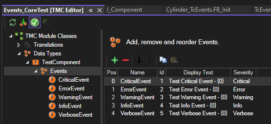

# Events

The framework provides a composition-based event system built on top of TcEventLogger. Events are decoupled from the components that raise them, and the three-interface design (`I_EventClass`, `I_EventArguments`, `I_EventReaction`) keeps components independent of any specific event infrastructure.

---

## I_EventClass

The primary interface for raising, clearing, and binding events.

| Member | Type | Description |
|--------|------|-------------|
| `RaiseEvent(EventId)` | Method | Raise a specific event by ID |
| `ClearEventById(EventId)` | Method | Clear a specific event by ID |
| `Arguments(EventId)` | Method → `I_EventArguments` | Access the argument builder for an event |
| `SetEvent(EventId, Trigger, AutoReset)` | Method | Bind a `POINTER TO BOOL` to an event; raises automatically when `TRUE`, optionally clears when `FALSE` |
| `ResetBySeverity(Severity)` | Method | Clear all events at or below the given severity |
| `IsResettable` | `BOOL` (Get) | `TRUE` when at least one trigger-bound event is raised but its trigger is currently `FALSE` |

---

## I_EventArguments

Adds context strings to an event before raising it. Supports method chaining.

| Member | Type | Description |
|--------|------|-------------|
| `AddString(Value)` | Method → `I_EventArguments` | Append a string argument to the event |
| `Clear()` | Method | Remove all arguments from the event |

---

## I_EventReaction

Maps event severities to machine reactions (e.g., stop, abort).

| Member | Type | Description |
|--------|------|-------------|
| `SetEventReactions(...)` | Method | Assign a reaction for each severity level |
| `GetHighestActiveEventReaction()` | Method → reaction | Returns the most severe active reaction |

---

## TcEventClass

Concrete implementation of `I_EventClass` that integrates with TcEventLogger.

### Setup

**Step 1 — Create a TcEventClass in the TwinCAT type system.**

Add all desired events for the component to this class. Placeholders `{0}..{x}` in event text are filled by `I_EventArguments`.



**Step 2 — Instantiate and generate events during module initialization.**

```pascal
VAR
    ModuleEvents : TcEventClass;
END_VAR

IF NOT Module.Initialized THEN
    ModuleEvents.GenerateTcEvents(Module.Name, ADR(TC_Events.TestComponent), SIZEOF(ST_TestComponent));
END_IF
```

### Usage

**Manual raise and clear:**

```pascal
ModuleEvents.RaiseEvent(E_TestComponent.CriticalEvent);
ModuleEvents.Reset();
```

**Trigger-bound with auto-reset (recommended):**

```pascal
// In FB_Init or initialization sequence — bind a BOOL to an event.
// The event raises automatically when TRUE and clears when it returns to FALSE.
ModuleEvents.SetEvent(E_TestComponent.CriticalEvent, ADR(bFaultCondition), AutoReset := TRUE);
```

**Reset button pattern using `IsResettable`:**

```pascal
IF ModuleEvents.IsResettable THEN
    // One or more trigger-bound events are raised but trigger is FALSE — safe to reset.
    ModuleEvents.Reset();
END_IF
```

**Adding arguments to an event:**

```pascal
ModuleEvents.Arguments(E_TestComponent.Warning).AddString('Axis 1').AddString('Torque limit');
ModuleEvents.RaiseEvent(E_TestComponent.Warning);
```

---

## Trace

Global utility for debug logging and diagnostics. Messages are broadcast to TcEventLogger and AdsLogger (both rate-limited to `MaxTraceMessagesPerScan`). Additional transports can be registered as subscribers.

```pascal
Trace.LogMessage(Key := 'SourceName', Value := 'Message text');
```

`Key` is the source label; `Value` is the message body. Output format: `Value: Key`.

**Custom logger (file logging, MQTT, or other transports):**

```pascal
Trace.Subscribe(myCustomLogger); // myCustomLogger implements I_TraceLogger
```
