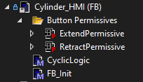

# HMI

HMI functions in the framework are independent of the main component/module objects to accommodate TcHMI, third-party HMIs, or custom needs. They are identified by the `_HMI` suffix. TcHMI-connected structs carry the `{attribute 'TcHmiSymbol.AddSymbol'}` pragma so they auto-map.

HMI functions are enabled or disabled by the parent module (e.g., only enabled in Manual mode). The `GetSystemTreeJsonHmiVisitor` can discover all registered HMI functions and build a JSON tree for dynamic HMI construction.

---

## HmiFunction

Abstract base for all HMI function blocks. Provides an `Enabled` property that the owning module sets to grant or revoke operator access.

| Member | Type | Description |
|--------|------|-------------|
| `FB_Init(Name, Statemachine)` | Constructor | Names the HMI function and links it to a statemachine |
| `Enabled` | `BOOL` (Get/Set) | Controls whether HMI commands are processed |
| `ControlType` | `STRING` (Get) | Identifies the TcHMI control type for this function |
| `RegisterWithParent(Parent)` | Method | Registers with a parent module for cyclic dispatch |

Extends: `CyclicComponent`

---

## Button

A single HMI button with a built-in `PermissiveInterlock`. The button command is only processed when the interlock conditions are all satisfied.

| Member | Type | Description |
|--------|------|-------------|
| `Active` | `BOOL` (Get/Set) | Set by the HMI when the button is pressed |
| `Permissive` | `PermissiveInterlock` | Interlock instance — all conditions must be `TRUE` to allow the command |

Extends: `HmiFunction`

---

## PermissiveInterlock

Aggregates up to 10 named boolean conditions. `OK` is `TRUE` only when every set condition is `TRUE`. Used for both button permissives and general interlock logic throughout the machine.

| Member | Type | Description |
|--------|------|-------------|
| `Set(Index, Reason, Value)` | Method | Set condition at index 0–9 with a descriptive reason string and boolean value |
| `OK` | `BOOL` (Get) | `TRUE` when all conditions are `TRUE` |

### Example

```pascal
VAR
    Interlock : PermissiveInterlock;
END_VAR

// In CyclicLogic — update conditions each scan
Interlock.Set(0, 'Door closed', DoorSensor);
Interlock.Set(1, 'No active fault', NOT Fault);
Interlock.Set(2, 'Machine in Manual', Mode = E_Mode.Manual);

IF Interlock.OK THEN
    // Safe to proceed
END_IF
```

---

## Example — Cylinder HMI

A complete HMI function block for a double-acting cylinder, showing how to read status, relay it to the HMI struct, and guard commands with permissives.

```pascal
FUNCTION_BLOCK Cylinder_HMI EXTENDS HmiFunction
VAR
    Cylinder : I_Cylinder;
    { attribute 'TcHmiSymbol.AddSymbol' }
    { attribute 'TcHmiSymbol.AddSymbol.UserGroups' := '__SystemAdministrators,Admin' }
    Cylinder_HMI : ST_Cylinder_HMI;
END_VAR

IF Cylinder = 0 THEN
    RETURN;
END_IF

// Mirror status to HMI struct
Cylinder_HMI.Name      := Cylinder.Name;
Cylinder_HMI.Busy      := Cylinder.Busy;
Cylinder_HMI.Error     := Cylinder.Error;
Cylinder_HMI.ErrorId   := Cylinder.ErrorId;
Cylinder_HMI.Extended  := Cylinder.Extended;
Cylinder_HMI.Retracted := Cylinder.Retracted;

// Process commands only when HMI is enabled
IF Enabled THEN
    ExtendRT(CLK := Cylinder_HMI.Extend.Active);
    IF ExtendRT.Q THEN
        IF Cylinder_HMI.Extend.Permissive.OK THEN
            Cylinder.Extend();
        END_IF
    END_IF

    RetractRT(CLK := Cylinder_HMI.Retract.Active);
    IF RetractRT.Q THEN
        IF Cylinder_HMI.Retract.Permissive.OK THEN
            Cylinder.Retract();
        END_IF
    END_IF
END_IF
```


